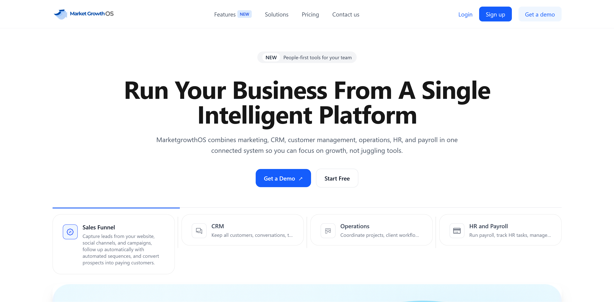
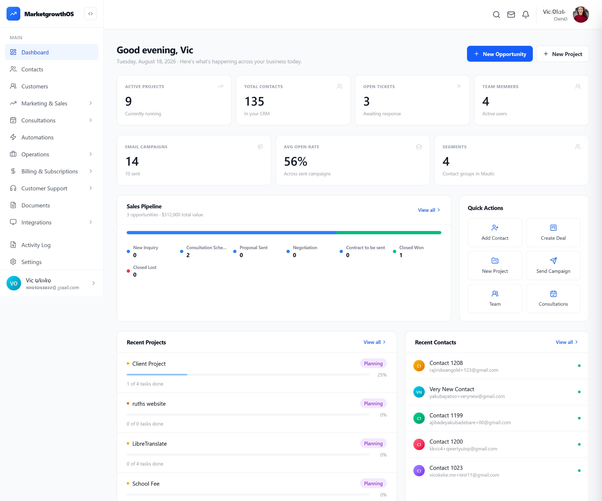
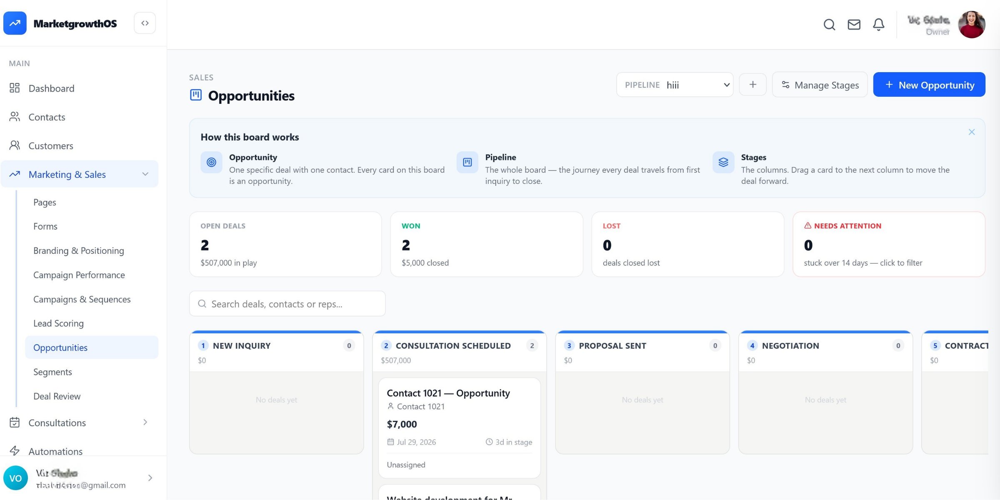
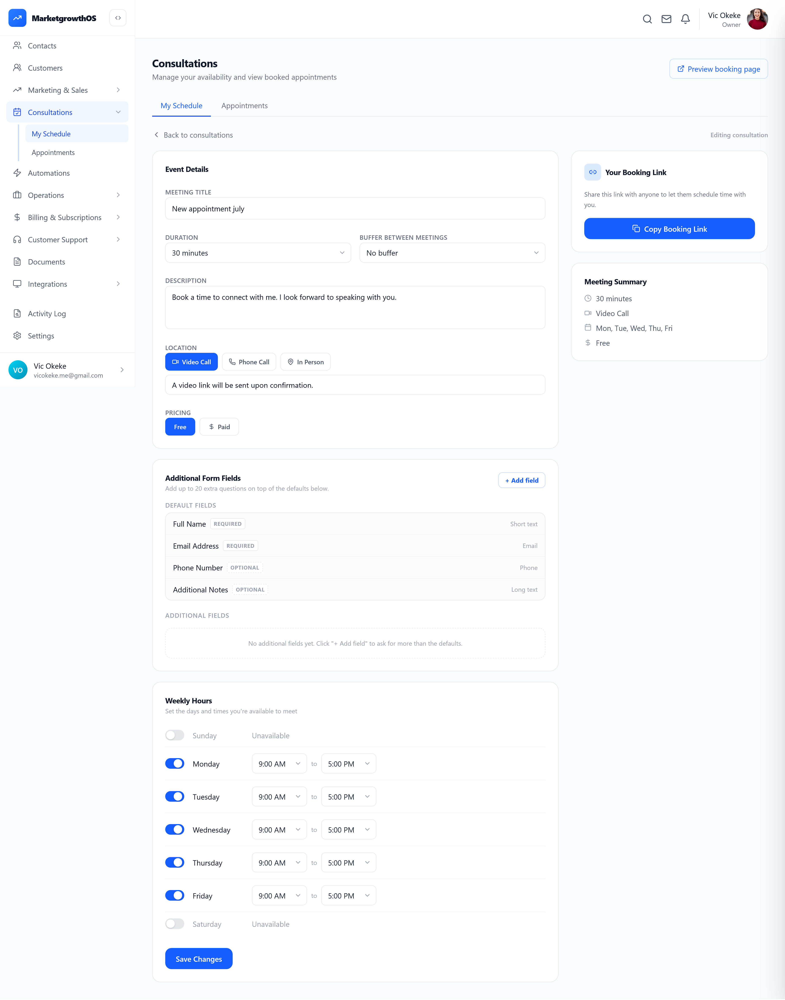

# MarketGrowthOS

## Multi-Tenant SaaS CRM & Growth Operations Platform

**Status:** Testing / Moving Toward Production  
**Role:** Sole Product Owner  
**Development:** 3-person engineering team  
**QA:** Product-owned

---

## Overview

MarketGrowthOS is a multi-tenant SaaS platform designed to bring CRM, marketing automation, consultations, project management, billing and operational workflows into a more unified environment for small and medium-sized businesses.

The product originated from a problem we were experiencing directly inside a digital marketing agency. Business workflows had become fragmented across CRM, project management, appointment management, marketing automation and other operational tools.

The individual tools worked, but the overall process depended heavily on manual coordination.

MarketGrowthOS was designed to bring the critical commercial workflow together, from lead acquisition and qualification through conversion, onboarding and operational delivery.

The difficult part was not deciding to build another business application. It was turning a broad business problem into a coherent product model that engineering could actually build and test.

---

## The Problems I Set Out to Solve

MarketGrowthOS was built around recurring operational problems faced by SMBs, service businesses and solopreneurs.

| Problem | Product decision |
|---|---|
| **Fragmented tools** | **Unified platform** — Bring CRM, marketing, consultations, project delivery, billing and support into one connected operating environment instead of forcing businesses to coordinate across multiple disconnected tools. |
| **Repetitive work** | **Automation** — Automate workflows, emails, campaigns and repetitive operational tasks around defined business events and customer states. |
| **Abandoned leads** | **Re-engagement** — Detect abandoned forms and create opportunities to re-engage prospects who entered the funnel but did not complete the intended action. |
| **Poor ad intelligence** | **UTM tracking** — Capture campaign and traffic parameters so businesses can connect lead activity back to advertising sources and make better-informed marketing decisions. |
| **Lead progression gaps** | **CRM lifecycle** — Create an explicit path from lead through qualification, opportunity and conversion, with defined gates, states and transition rules. |
| **Consultation gap** | **Native consultation system** — Build a configurable consultation capability for scheduling, intake and qualification, including support for businesses and solopreneurs offering paid consultations as a service. |
| **Delivery visibility** | **Project management + client monitoring/feedback** — Give teams a shared workspace for project delivery while allowing clients to see real-time progress, monitor work and provide structured feedback. |

> **The product principle:** identify the operational gap first, then decide what GrowthOS should build, integrate, automate or defer.
---

# Product in Action

## Merchant Dashboard

*Unified view across CRM, sales, operations, projects, contacts, campaigns and consultations.*

## Opportunity Pipeline

*Explicit sales stages and controlled progression through the commercial lifecycle.*

## Consultation System

*A configurable consultation workflow supporting scheduling, meeting format, free or paid consultations, intake fields and merchant-controlled availability.*

---

# The Product Challenge

The initial product vision was broad.

The scope cut across sales, marketing, consultations, CRM, project management, automation, billing and support, with HR and Payroll planned for a future scope.

The product work therefore became as much about deciding **what should be built and what should not be built** as it was about defining features.

Some requirements were broad, some timelines were unrealistic, and some proposed functionality duplicated capabilities that already existed in systems we intended to use.

The challenge was to turn that broad business ambition into a product that could be designed, specified, built and tested.

---

# My Role

I have been the **sole Product Owner** for MarketGrowthOS.

My responsibilities have included:

- Product discovery and problem decomposition
- Product architecture
- Multi-tenant model design
- Workflow and lifecycle design
- CRM lifecycle design
- Scope and V1 decisions
- Integration boundary definition
- Product specifications
- Engineering collaboration and feasibility review
- Product/system impact analysis
- QA process design and execution
- Production-readiness validation

I work directly with the engineering team throughout implementation rather than treating the product specification as a one-way handoff.

---

# Product Architecture

## Three-Tier Tenant Model

One of the foundational product decisions was the three-tier tenant architecture.

The model establishes clear boundaries between:

**Platform → Merchant/Business → Customer**

This required explicit decisions around:

- Organisation boundaries
- Users
- Teams
- Roles
- Permissions
- Customer ownership
- Data relationships
- Tenant isolation

The architecture was established as a product model rather than treating each feature as an isolated screen.

---

## System Boundaries

A recurring architectural decision was determining what GrowthOS should own and what should remain with external systems.

The core principle was:

> **GrowthOS owns business state. Mautic owns marketing execution. Stripe handles payment infrastructure.**

### GrowthOS

GrowthOS owns the core business and operational state, including:

- CRM records
- Lifecycle state
- Qualification and conversion logic
- Permissions
- Consultations
- Workflow orchestration
- Billing state

### Mautic

Mautic serves as the marketing engine for capabilities such as:

- Forms
- Landing pages
- Campaigns
- Nurture sequences
- Segmentation
- Tags
- Marketing behavioural signals

Rather than rebuilding functionality that already existed upstream, I defined the boundary between the systems and the data/workflows that cross it.

### Stripe / Stripe Connect

Stripe is used for payment processing and subscription infrastructure.

GrowthOS also uses Stripe Connect at the merchant level to support businesses offering subscription-based services to their own customers.

This creates a distinction between:

- GrowthOS platform billing
- Merchant-level customer billing

That distinction matters because the merchant's commercial relationship with its customer is different from the merchant's relationship with the GrowthOS platform.

---

# CRM Lifecycle

The CRM was one of the areas where the underlying product logic mattered more than the interface.

The lifecycle was designed around:

**Lead → Qualification → Prospect → Opportunity → Conversion → Onboarding**

Rather than allowing records to move freely between statuses, I defined explicit valid state transitions.

This made the lifecycle predictable and prevented invalid or contradictory movement through the commercial process.

## Qualification Gate

Qualification was designed as a **two-step gate** rather than a single status change.

The purpose was to separate the qualification decision from the downstream movement of the customer through the commercial lifecycle.

## Policy-Driven Conversion

Customer conversion was also designed around explicit policy rather than treating conversion as a simple button action.

The system evaluates the applicable conversion policy before allowing a record to become a customer.

This makes conversion a business decision with defined conditions and consequences rather than an uncontrolled status change.

---

# Build vs. Integrate

One of the recurring product decisions was determining what MarketGrowthOS should own and what should remain with an existing system.

The guiding question was not simply:

> **Can we build this?**

It was:

> **Does this need to exist in GrowthOS, and what should GrowthOS be responsible for?**

This resulted in several deliberate decisions to integrate existing capabilities rather than recreate them, while building native functionality where the existing systems did not adequately support the required business workflow.

---

# Custom Consultation System

Mautic does not provide the appointment and consultation capability required by MarketGrowthOS.

Rather than forcing the workflow into a marketing-form model, we designed a **lean configurable consultation system** as a native GrowthOS capability.

The system allows merchants/admins to configure consultation experiences without requiring developer involvement.

It supports:

- Consultation types
- Duration and availability
- Date and time selection
- Time-zone handling
- Virtual, phone and in-person meetings
- Free or paid consultations
- Configurable intake fields
- Required and optional information
- Field ordering
- Single-page or multi-step forms
- Qualification and intake questions
- File uploads
- Consent capture
- Structured submission output

The system was designed for two related use cases:

1. **Businesses using consultations as part of lead qualification or customer acquisition**
2. **Solopreneurs and service providers selling consultations as a service**

This made consultation booking a commercial capability rather than simply an appointment form.

---

# Scope & V1 Decisions

MarketGrowthOS contains a broad set of functionality, but not everything that could theoretically be built belongs in the first version.

I made V1 decisions based on:

- Business value
- Technical feasibility
- Existing platform capability
- Development capacity
- Dependency complexity
- Whether functionality was necessary for the initial product

This included deliberately avoiding the rebuild of capabilities that could be handled effectively by existing systems.

The product became more manageable once the question changed from:

> "Can we build this?"

to:

> "Does this need to exist in this version, and does it belong in this product?"

---

# Product Specifications

Once the workflows and product model were sufficiently clear, I translated them into detailed specifications for engineering.

The specifications cover:

- User roles
- Permissions
- States
- Transitions
- Business rules
- Data requirements
- Workflow dependencies
- Integration behaviour
- Edge cases
- Validation requirements
- Expected system behaviour

I work with engineering during this process rather than waiting until the specification is complete.

This allows technical constraints, dependencies and implementation implications to influence the product while decisions can still be changed.

---

# QA & Product Validation

There is no separate QA function for MarketGrowthOS, so I built and run the product QA process myself.

I created a **1,200+ line QA checklist across 15 modules**, followed by a second-stage validation approach using **Given-When-Then (GWT)** scenarios.

The goal is not simply to determine whether individual screens work.

The validation process checks whether the implemented product follows the intended product model.

This includes:

- Workflow behaviour
- State transitions
- Permissions
- Validation rules
- Dependencies
- Cross-module behaviour
- Exception handling
- Integration behaviour
- Data consistency
- Specification compliance

---

# Catching Problems Before Code

Owning both product specification and QA creates an opportunity to identify contradictions before they become implementation problems.

During specification review, I identified a contradiction in the webhook/integration requirements around bidirectional contact synchronization between MarketGrowthOS and Mautic.

The issue was identified before it became code, allowing the intended behaviour to be clarified rather than leaving engineering to interpret conflicting requirements.

This is part of how I approach product specifications: not simply as feature lists, but as models of expected system behaviour.

---

# Engineering Collaboration

MarketGrowthOS is being developed by a small engineering team.

My working approach is to involve engineering in product reasoning early rather than treating engineering as a downstream implementation function.

The general sequence is:

**Problem → Decomposition → Workflow → Engineering Input → Refinement → Specification → Build → QA → Iteration**

This allows feasibility, dependencies and technical constraints to influence product decisions before they become expensive to change.

---

# What I Learned

MarketGrowthOS changed how I approach scope.

Earlier in my product work, I was more willing to accept broad requirements and unrealistic timelines and then try to make everything happen.

The more useful product responsibility is sometimes to say that the requested solution or timeline does not work, explain why, and propose a smaller or more practical path.

That has become an important part of how I work with stakeholders and engineering.

---

# What This Project Demonstrates

### 0→1 Product Ownership

Taking a broad business problem from discovery through product definition, engineering and validation.

### Technical Product Management

Working across architecture, integrations, dependencies and implementation constraints without losing sight of the business problem.

### Workflow & Systems Thinking

Designing states, gates, permissions, transitions and downstream consequences rather than focusing only on screens.

### Product Scope

Knowing when to build, integrate, defer or reject functionality.

### Specification

Turning product decisions into detailed, testable implementation requirements.

### QA Ownership

Validating the implemented product against intended behaviour and identifying contradictions before they become production problems.

---

# Current Status

**Stage:** Testing / Moving Toward Production

**Product ownership:** Sole Product Owner

**Development:** 3-person engineering team

**QA:** Product-owned

**Primary evidence:** Product definition, architecture, workflows, specifications, implementation and QA

---

# Other Product Case Studies

- **NexaLife Care** — Healthcare referral and access platform  
  [View case study](https://github.com/Xmokey/NexaLife-Care-HealthTech-Platform-Case-Study)

- **UrCalls** — SaaS video communications platform  
  [View case study](https://github.com/Xmokey/UrCalls-Video-Conferencing-SaaS-Platform-Case-Study)

- **Zenith Property Repairs** — Property services platform  
  *Case study coming next*
